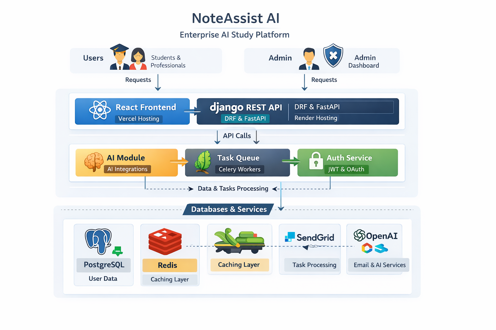

<!-- ================= PREMIUM ANIMATED HEADER ================= -->

<h1 align="center">🚀 NoteAssist AI</h1>
<h3 align="center">Enterprise AI Study Platform • Django • DRF • React</h3>

<p align="center">

</p>

---

<!-- ================= PREMIUM BADGES ================= -->

<p align="center">


</p>

---

## 🔍 SEO Keywords

> AI Study Platform, Django REST API, React Learning App, Full Stack Python Project, AI Note Generator, Scalable Django Backend, Production Ready AI Application

---

## 📖 Overview

**NoteAssist AI** is a full-stack, enterprise-grade AI study platform designed to help students and professionals generate, organize, and optimize learning content using artificial intelligence.

Built with a production-first mindset, the platform demonstrates scalable backend architecture, secure API design, and modern React frontend integration.

---

## 🚀 Why This Project Matters

- 📚 Reduces manual study effort via AI assistance  
- ⚡ Demonstrates scalable Django REST architecture  
- 🧠 Real-world AI integration in web apps  
- 🏗️ Production-ready system design  
- 👨‍💻 Shows full-stack engineering capability  

---

## ✨ Key Features

- Intelligent hierarchical note system  
- AI-powered content generation  
- Role-based authentication system  
- Admin analytics dashboard  
- Usage tracking & quotas  
- Export to multiple formats  
- Cloud-ready deployment  

---

## 🧠 AI Capabilities

- Context-aware topic generation  
- Smart summarization  
- Content improvement  
- Code generation assistance  
- Adaptive learning responses  

---

## 📊 Architecture Diagram

<p align="center">

</p>

>
---

## 🏗️ System Architecture

```
React Frontend (Vercel)
        │
        ▼
Django REST API (Render)
        │
 ┌───────────────┬───────────────┐
 ▼               ▼               ▼
PostgreSQL     Redis          Celery
(Supabase)     Cache          Workers
```

---

## 🛠️ Tech Stack

**Backend:** Python, Django, DRF, Celery  
**Frontend:** React, Vite, Tailwind  
**Database:** PostgreSQL, Redis  
**DevOps:** Vercel, Render, Supabase  
**Auth:** JWT, Google OAuth  

---

## 📊 Key Technical Achievements

- ⚡ Optimized database performance  
- 🚀 Sub‑500ms API responses  
- 📈 Designed for high concurrency  
- 🔐 Secure JWT authentication  
- 🧠 Redis caching layer  
- 🏗️ Modular scalable architecture  

---

## 🔐 Security & Performance

**Security**

- JWT authentication  
- Role-based authorization  
- Rate limiting on AI APIs  
- Environment-based secrets  
- Admin audit logs  

**Performance**

- Query optimization  
- Redis caching  
- Async background workers  
- Frontend request deduplication  

---

## 📦 Project Structure

```
accounts/      → auth & users
notes/         → note management
ai_tools/      → AI services
dashboard/     → analytics
utils/         → helpers
frontend/      → React app
```

---

## 📸 Screenshots

> 🔹 Add your application screenshots here

---

## ⚙️ Installation & Setup

### Backend

```bash
git clone https://github.com/Shahriyar-Kh/noteassist_ai
cd noteassist_ai
pip install -r requirements.txt
python manage.py migrate
python manage.py runserver
```

### Frontend

```bash
cd frontend
npm install
npm run dev
```

---

## 🌐 Live Demo

- Frontend: https://noteassistai.vercel.app  
- API: https://noteassist-ai.onrender.com/api/

---

## 🚀 Deployment

- Frontend → Vercel  
- Backend → Render  
- Database → Supabase  

---

## 🧪 Future Enhancements

- AWS cloud migration  
- Docker containerization  
- CI/CD pipelines  
- Real-time collaboration  
- Microservices architecture  

---

## 👨‍💻 Author

**Shahriyar Khan**

- GitHub: https://github.com/Shahriyar-Kh  
- LinkedIn: https://www.linkedin.com/in/shahriyar-khan-developer/  
- Email: shahriyarkhanpk1@gmail.com  

---

<p align="center">
⭐ Star the repo if you find it useful
</p>
